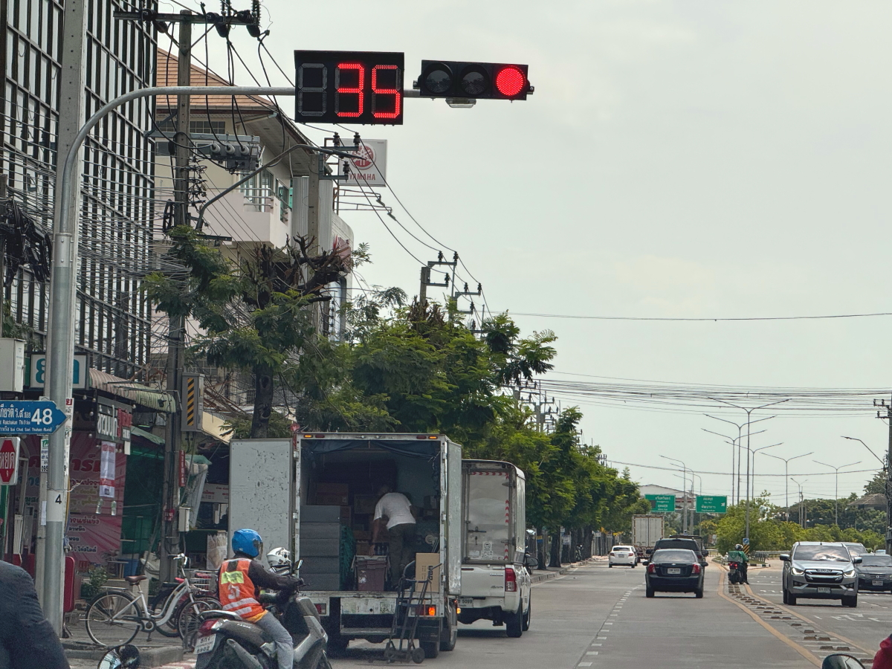
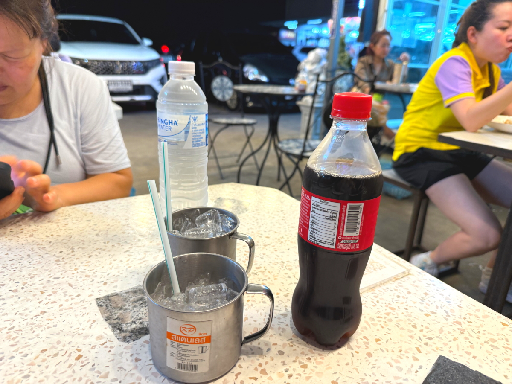
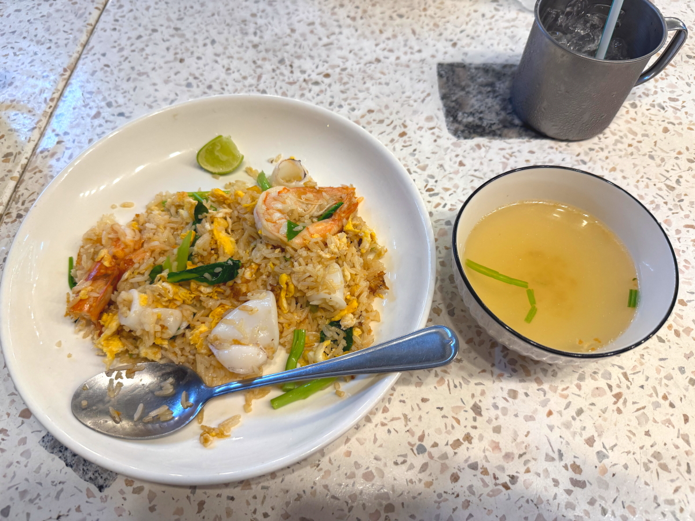

# 20250803_bangkok

<html lang="ja" data-loaded="false" data-scrolled="false" data-spmenu="closed">
<head>

<meta charset="UTF-8">
<meta http-equiv="Content-Type" content="text/html; charset=UTF-8">
<meta http-equiv="X-UA-Compatible" content="IE=EmulateIE10" />
<meta http-equiv="X-UA-Compatible" content="IE=edge">

<meta name="viewport" content="width=device-width, initial-scale=1.0">

<!--ここから上はお決まりの定型文です-->

<!--ここからが表現の書式などを決めるcssという部分-->

<link href="https://cdnjs.cloudflare.com/ajax/libs/lightbox2/2.7.1/css/lightbox.css" rel="stylesheet">

</head>

<body>

モバイル端末をお使いの場合は、画面を横向きにすると
より見やすくご覧頂けます。

<!--ここ上は、ほぼそのまま使います！-->

<!--QRコードの挿入例-->

 アクセス用QRコード

<marquee direction="left" scrollamount="20" width="30%">(^_^)/~alis</marquee>

<!--流れ文字の挿入例-->
<h1><marquee behavior="left">!!! 2025/08/01-03、庭になった南国フルーツから、バンコク中心部のショッピングモールまで!!!</marquee></h1>

                          

<!--ここから下が、本体部分-->
    

 
<h2>1日庭の果実はそのまま食べられます</h2>

    
<h2>日本には入って来ていない短いバナナ</h2>

    
<h2>パパイヤもそのまま、透明の汁は飲み干して果実をスプーンで掻き出します</h2>

    
<h2>バンコク周辺部の道路事情、平日日中はかなり空いてました</h2>

    
<h2>タイの信号機、カウントダウンシステムは良いですね〜</h2>

    
<h2>止めてた車はかなりホットなので、MaxA/Cボタンで急速冷却します</h2>

    
<h2>バス停でスマホいじってるお爺さん</h2>

    
<h2>左側通行ですが、バイクの右端逆走が合法とのこと</h2>

    
<h2>バンコク中心部に向かうと車がかなり増えてきます</h2>

    
<h2>モノレールの高架や、道路構造が立体的</h2>

    
<h2>市内の一般的な交通状況 画像クリックで動画再生します↓</h2>

    
<h2>逆走バイクは歩道まで走ります 画像クリックで動画再生します↓</h2>

    
<h2>中心部のショッピングモール、宇都宮のBellMallが小さく感じる規模 画像クリックでGoogleMapsに飛びます↓</h2>
<a href="https://www.google.com/maps/place/Legend+Heroes+Seacon+Square+Srinakarin/@13.6942876,100.647486,3a,75y,122.95h,105.04t/data=!3m7!1e1!3m5!1sh8yaMkOcnop5KfraflSOYQ!2e0!6shttps:%2F%2Fstreetviewpixels-pa.googleapis.com%2Fv1%2Fthumbnail%3Fcb_client%3Dmaps_sv.tactile%26w%3D900%26h%3D600%26pitch%3D-15.0365895082018%26panoid%3Dh8yaMkOcnop5KfraflSOYQ%26yaw%3D122.95482248415931!7i16384!8i8192!4m6!3m5!1s0x311d6196585e8b0b:0xc0b343270b18bd8a!8m2!3d13.6928108!4d100.6479876!16s%2Fg%2F11wvlslm2y?authuser=0&entry=ttu&g_ep=EgoyMDI1MDczMC4wIKXMDSoASAFQAw%3D%3D" target="_blank"></a>

    
<h2>金のショップはどこでも必ずあります</h2>

    
<h2>4階まで上がるとフードコートフロア</h2>

    
<h2>お昼はチャーハン</h2>

    
<h2>各店舗共通の食器ケースは１箇所、見つかりませんでした</h2>

    
<h2>辛すぎて口の中が火事になったので、甘い果物で口直し</h2>

    
<h2>フロアの広さを生かした、おしゃれなシートスペース</h2>

    
<h2>JAPANブランドは全てありました</h2>

    
<h2>郊外エリアに戻ると、果物屋さんの露店</h2>

    
<h2>手頃なサイズのスーパーも繁盛してます</h2>

    
<h2>スイカがこの値段(約100円)で入ってきたら、日本の農業は壊滅かも？</h2>

    
<h2>他の果物も日本の感覚とは全く違う格安感</h2>

    
<h2>コンビニ駐車場にも屋台が併設されてます</h2>

    
<h2>タイ人たちは自炊せずに外食が多いようです</h2>

    
<h2>晩御飯はこれで済ませました</h2>

    
<h2>コンビニの空にはお月様</h2>

    
<h2>2日の朝、庭で野鳥が餌探し</h2>

    
<h2>中心部に向かう道路脇のビルは熱帯エリアの色使い</h2>

    
<h2>屋台のバイクは移動中に食材の仕込み、奥様は台所から出て来たそのままの姿</h2>

    
<h2>ショッピングモールの地下駐車場に入ります</h2>

    
<h2>止めた場所と使ったエスカレータはしっかり記録して迷子防止</h2>

    
<h2>レストランは給仕ロボット、店員さんがサポートしてました</h2>

    
<h2>日本と違ってチップシステムがあるので忘れずに！</h2>

    
<h2>家電エリアのTVの価格感</h2>

    
<h2>街で見かける一般的なバイク</h2>

    
<h2>赤ちゃんは両親が挟んで移動します</h2>

    
<h2>市内を流れる一般的な小川、ワニサイズのトカゲが居ます</h2>

    
<h2>こちらのパパイヤもそろそろ食べごろ</h2>

         

  
<h2>再掲【暑中お見舞い（ほたる）】LINEでご挨拶・動画で送る夏のグリーティングカード / ギターbgm/蛍の光・癒し動画</h2>

<iframe width="560" height="315" src="https://www.youtube.com/embed/Z4PKDOhRzfI?si=LaAJ8dA-1izGspEO" title="YouTube video player" frameborder="0" allow="accelerometer; autoplay; clipboard-write; encrypted-media; gyroscope; picture-in-picture; web-share" referrerpolicy="strict-origin-when-cross-origin" allowfullscreen></iframe>
    
   
    
    
    

  
<h2>今日のBGMもタイらしく ดนตรีคลาสสิกที่ผ่อนคลายและสวยงาม 🌿 โมสาร์ท เบโธเฟน โชแปง บาค ไชคอฟสกี้ ชูเบิร์ต</h2>

<iframe width="560" height="315" src="https://www.youtube.com/embed/5FLpIkoPm6c?si=RTK-RIu0LzgMMASo" title="YouTube video player" frameborder="0" allow="accelerometer; autoplay; clipboard-write; encrypted-media; gyroscope; picture-in-picture; web-share" referrerpolicy="strict-origin-when-cross-origin" allowfullscreen></iframe>
    

    
  
<h2>もう一つ、7月11日にメタバースで披露されたまいてゃさんの新曲 ちょっと音量小さめなのでボリュームあげて下さい</h2>

<iframe src="https://www.youtube.com/embed/K3CuXhdeKlY?si=yPW9XjXo5Hi18oeY" title="YouTube video player" frameborder="0" allow="accelerometer; autoplay; clipboard-write; encrypted-media; gyroscope; picture-in-picture; web-share" referrerpolicy="strict-origin-when-cross-origin" allowfullscreen></iframe>
    

    
    

    
    
    <h3>「雪の中で輝くシンデレラ」by まいてゃ</h3>
<h2><a href="https://torokoid.github.io/20250219_chiangrai/maitiyaz.mp3" target="_blank">この文字クリックで再生します 下の再生ボタンでも同じ曲をループ再生します</a></h2>

    <audio controls loop>
        <source src="https://torokoid.github.io/20250219_chiangrai/maitiyaz.mp3" type="audio/mpeg">
        お使いのブラウザは audio タグをサポートしていません。
    </audio>
 
    
<!--
  
<h2>スティーブ・ジョブズの伝説の講義</h2> 
<iframe width="560" height="315" src="https://www.youtube.com/embed/XsRpvWHIVw0?si=f7IA0pv9iZWVk3VH" title="YouTube video player" frameborder="0" allow="accelerometer; autoplay; clipboard-write; encrypted-media; gyroscope; picture-in-picture; web-share" referrerpolicy="strict-origin-when-cross-origin" allowfullscreen></iframe>    
    
    
<h2>スティーブ・ジョブズ氏の講義の内容が「笑って死ぬ」by まいてゃ さんの歌の内容と大筋で同じに聞こえます 以下に再掲しますね</h2>

    
<h3>歌の後半部分しか撮れてませんが、2月16日のイベントで公開された「笑って死ぬ」 by まいてゃ 白ドレスはダンサーの玖遠さん、黒いドレスがまいてゃさん</h3>
<iframe width="560" height="315" src="https://www.youtube.com/embed/s4ZcbxAluMM?si=Xa32xo19UCNaWv0v" title="YouTube video player" frameborder="0" allow="accelerometer; autoplay; clipboard-write; encrypted-media; gyroscope; picture-in-picture; web-share" referrerpolicy="strict-origin-when-cross-origin" allowfullscreen></iframe> 
-->
    

    <h3>お気に入りの「笑って死ぬ」 by まいてゃさんも再々掲です</h3>
<h2><a href="https://torokoid.github.io/20250221_chiangrai/maitiya3.mp3" target="_blank">この文字クリックで再生します 下の再生ボタンで同じ曲をループ再生します</a></h2>

    <audio controls loop>
        <source src="https://torokoid.github.io/20250221_chiangrai/maitiya3.mp3" type="audio/mpeg">
        お使いのブラウザは audio タグをサポートしていません。
    </audio>

   
<h2>以上、庭の南国フルーツから、バンコク中心部のショッピングモールまででした。。 ここまでご覧いただきありがとうございました。</h2>

     
<h2>
<a href="https://torokoid.github.io/Mashiko_himawari_3/" target="_blank">クリックでメニューページに戻ります</a>
</h2>

   

         

  

      

<!--本体はここまで-->

<!--画面に空白地帯を作って、背景が見えるようにしています-->
                                              

<!-- フッタ -->
<footer>

Copyright 2025/08/03 alis @Bangkok

</footer>

<!--HPにさまざまなJavaScriptを呼び込むための書式-->

    
    </body>
    
</html>
